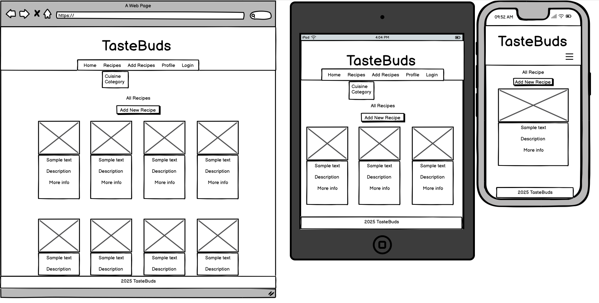
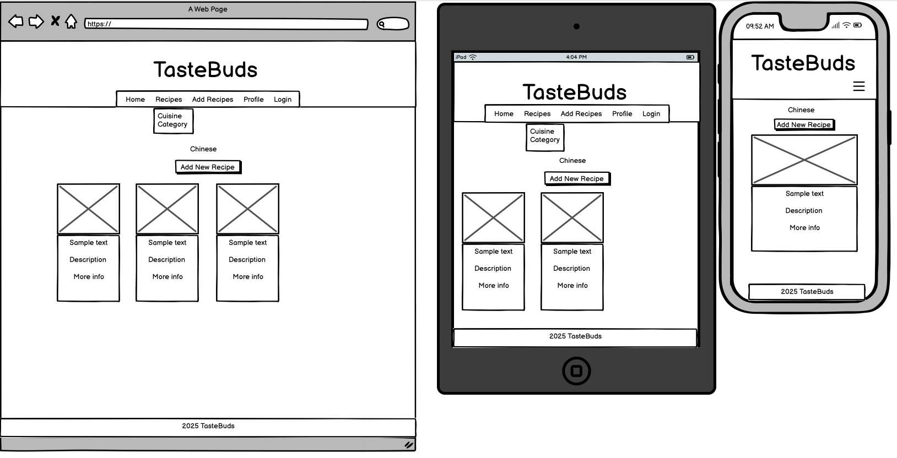

# TasteBuds

ADD LOGO HERE!!!!!!!!!!!!!

TasteBuds is a full stack e-commerce website built using Django, Python, HTML, CSS and JavaScript.

ADD SITE URL HERE !!!!!!!!!!!!!!!


---

## User Experience

### Strategy Plane

#### **Project Goals**

TasteBuds is a Business to Consumer (B2C) web application designed for anyone passionate about cooking — from beginners experimenting in the kitchen to seasoned home chefs. The platform allows users to discover, share, and organise recipes in a simple, elegant interface.

The primary audience includes food enthusiasts who want a digital space to store their favourite recipes, find inspiration from others, and contribute their own culinary creations. Whether someone is planning a quick weekday meal or looking for an impressive dish for guests, this app aims to be their go-to recipe hub.

In recent years, the growing popularity of platforms like TikTok, Instagram, and YouTube has contributed to a surge in interest around home cooking and recipe sharing. According to surveys and food trend reports, more people are cooking at home than ever before — driven by a desire for healthier eating, budget-conscious choices, and the joy of sharing food with loved ones.

This app leverages that momentum by providing a community-driven platform where users can:

* Search and browse a wide variety of recipes
* Share their own culinary creations
* Favourite and comment on others’ dishes
* Keep all their go-to meals in one easy-to-access place

As someone who enjoys cooking and believes in the power of food to bring people together, I built this project to create a space where recipes and stories can be shared, tried, and loved.

## Scope Plane

### Feature Planning

Below is a feature planning table outlining the key opportunities for the Django Recipe App. Each feature has been rated for **Importance** and **Viability** (on a scale from 1 to 5). Features that score highly on both are considered essential for the **Minimum Viable Product (MVP)**. Medium-scoring features are *should-have* items, which may be added after MVP launch. Low-scoring features are *could-have* features and can be planned for future updates.

The application includes different user roles:

- **Guest**: Unauthenticated users who can browse public content.
- **User**: Registered users who can create, like, and comment on recipes.
- **Admin**: Superusers with additional access to manage users and content.

| User Type | Feature | Importance | Viability | MVP Status |
|-----------|---------|------------|-----------|------------|
| Guest | Browse recipe list | 5 | 5 | ✅ |
| Guest | View recipe details | 5 | 5 | ✅ |
| Guest | Search and filter recipes | 5 | 5 | ✅ |
| Guest | Sign up for an account | 4 | 5 | ✅ |
| User | Log in/out | 5 | 5 | ✅ |
| User | Create new recipe | 5 | 5 | ✅ |
| User | Edit/delete own recipes | 5 | 5 | ✅ |
| User | Like a recipe | 4 | 4 | ✅ |
| User | View personal recipe dashboard | 4 | 4 | ✅ |
| User | Comment on recipes | 3 | 3 | ✅ |
| User | Rate recipes | 3 | 3 | ❌ |
| User | Password reset | 5 | 5 | ✅ |
| User | Upload images for recipes | 5 | 5 | ✅ |
| User | Manage person bio | 4 | 4 | ✅ |
| Admin | Access Django admin panel | 5 | 5 | ✅ |
| Admin | Delete inappropriate user content | 4 | 4 | ✅ |
| Admin | Manage users (ban, promote) | 3 | 3 | ❌ |
| All | Responsive design for mobile/tablet | 5 | 4 | ✅ |
| All | View profile pages of recipe creators | 3 | 4 | ❌ |
| All | Share recipes via social media | 2 | 3 | ❌ |

## Structure Plane

### User Stories

| User Story ID | As a/an | I want to be able to... | So that I can... |
|---------------|---------|--------------------------|------------------|
| 1 | Guest | Browse a list of all recipes | Explore what’s available without signing up |
| 2 | Guest | View full details of a recipe | Decide if I want to try making it |
| 3 | Guest | Search for and filter recipes by keyword or category | Find exactly what I’m in the mood to cook |
| 4 | Guest | Sign up for an account | Save and contribute my own recipes |
| 5 | User | Log in and log out | Access my personal content securely |
| 6 | User | Create and submit a new recipe | Share my cooking ideas with the community |
| 7 | User | Edit or delete my own recipes | Keep my content up to date or remove it |
| 8 | User | Like a recipe | Show appreciation and bookmark favorites |
| 9 | User | View a dashboard of my own recipes | Manage my contributions in one place |
| 10 | User | Upload images to my recipes | Make my recipe posts visually appealing |
| 11 | User | Reset my password | Recover access if I forget my login |
| 12 | User | Manage my personal bio and profile info | Customize my profile for others to see |
| 13 | User | Comment on recipes | Share feedback or ask questions about recipes |
| 14 | Admin | Access the Django admin panel | Manage backend tasks and oversee site activity |
| 15 | Admin | Delete inappropriate or flagged content | Keep the platform safe and welcoming |
| 16 | Admin | Promote or restrict user access *(Future Feature)* | Control user permissions and moderation |
| 17 | All | View the site on mobile/tablet devices | Use the app seamlessly on any screen |
| 18 | All | View profile pages of recipe creators *(Future Feature)* | Learn more about users behind recipes |
| 19 | All | Share recipes via social media *(Future Feature)* | Let others know about my favorite dishes |
| 20 | User | Rate recipes *(Future Feature)* | Help others by giving feedback on what I’ve cooked |

## Database Schema

For this project, I’ve chosen to use a **relational database** (PostgreSQL for production and SQLite for development) as it provides the necessary flexibility, robust relationships, and **normalisation** to efficiently manage data for the recipe-sharing application.

The application will handle multiple types of data, including users, recipes, categories, comments, and likes. Django's built-in user model and ORM are well-suited for managing these relationships, which include one-to-many (user to recipes), many-to-many (users and recipes via likes), and foreign key relationships.

### Normalisation Decisions

In order to improve data **normalisation** and avoid redundancy, I made a few key design decisions:

- **User Profile Information**: Instead of modifying the default `User` model, I created a separate `Profile` model linked via a one-to-one relationship. This allows flexibility and avoids redundant data while still storing additional user-specific information such as the display name, bio, and avatar.
  
- **Image Handling with Cloudinary**: Recipe images are uploaded to **Cloudinary** using the `CloudinaryField` provided by the `django-cloudinary` package. This allows images to be stored remotely while only the URL is saved in the database, ensuring efficient storage management and improved performance.

- **Likes and Comments**: These features are stored in separate models to avoid bloating the `Recipe` model and to provide flexibility for future expansions, such as implementing notifications, moderation, or analytics.

- **Categorisation**: Recipes are linked to categories via a foreign key. This makes it easy to filter recipes by category, improving user experience and navigation.

### Entity Relationship Overview

Here's a summary of the main models and their relationships:

- **User**: The built-in Django model, used for authentication.
- **Profile**: One-to-one with the `User` model; stores user-specific details like display name, bio, and avatar.
- **Recipe**: Linked to a `User` (author) and a `Category`; includes fields like title, description, ingredients, steps, image (Cloudinary), and timestamps.
- **Category**: A simple category label (e.g., "Vegan", "Dessert"), with a one-to-many relationship to `Recipe`.
- **Comment**: Stores user comments on recipes, with foreign keys to both the `User` and `Recipe` models.
- **Like**: A many-to-many relationship between `User` and `Recipe`, allowing users to like recipes.

### Sample Table Relationships

| Table    | Fields | Relationships |
|----------|--------|---------------|
| **User** | (Django default) | One-to-One with Profile |
| **Profile** | user (FK), display_name, bio, avatar | FK to User |
| **Recipe** | title, description, image (Cloudinary), ingredients, steps, author (FK), category (FK), created_at | FK to User, FK to Category |
| **Category** | name | One-to-Many with Recipe |
| **Comment** | recipe (FK), user (FK), content, timestamp | FK to User, FK to Recipe |
| **Like** | user (FK), recipe (FK) | Many-to-Many via intermediate model or Django's built-in `ManyToManyField` |

### Image Handling in Detail

For the recipe images, when a recipe is created or updated, the image is uploaded to **Cloudinary** using the `cloudinary.uploader.upload()` method. The URL returned by Cloudinary is saved in the `Recipe` model, which links to the image hosted remotely.

[Database Schema](documentation/readme/DatabaseSchema.png)

### Skeleton Plane

#### **Wireframes**

Wireframes for the project were created using [Balsamiq](https://balsamiq.com/)

##### **Base Template** 

This template contains the header and footer which are used throughout the website. This template is used as a base and then other pages content will be injected into main section using django template language.


##### **Home Page**



##### **Recipe Details Page**

The recipe detail page will provide users with an in-depth look at a specific recipe, displaying all the relevant information about the dish. This includes:

* Recipe Title: The name of the recipe.
* Ingredients: A list of ingredients needed to prepare the recipe.
* Instructions: Step-by-step directions for cooking or preparing the dish.
* Prep Time: How long it takes to prepare and cook the recipe.
* Images: Photos of the completed recipe or cooking process.
* Author Information: Who shared the recipe.
* User Interactions: Options to leave a comment or like the recipe.


##### **Add Recipe Page**

The add a recipe page will allow users to contribute their own recipes to the platform. It will have a simple, user-friendly form with fields to:

* Recipe Title: A name for the recipe.
* Category: A dropdown to classify the recipe (e.g.Breakfast, Lunch, etc.).
* Ingredients: A field to enter a list of ingredients needed for the recipe.
* Instructions: A text box to input the steps for making the recipe.
* Image: An option to upload an image of the dish or an image of the process.
* Prep Time: An input field to specify how long the recipe will take to prepare and cook.

Once users submit their recipe, it will be stored in the database and visible to others in the recipe collection.


##### **Filtered Recipe Page**

The filter by category page allows users to easily browse recipes by their preferred categories. Categories could include options like "Breakfast, Lunch, etc". Each category will display a grid of recipes that match the selected category. Users can click on any recipe title to view its details.

Additionally, the page will include filtering by Cuisine, allowing users to further narrow down their search. This feature is designed to make it easier for users to find recipes that fit their tastes and needs, ensuring a smoother browsing experience.



##### **Login Page**

The login page will allow users to sign into their account using their registered credentials. Users can log in with their username or email address, and they will need to enter the correct password associated with their account. If a user has forgotten their password, a password recovery link will be provided to help them reset their password.


##### **Register Page**

The register page will allow users to create a new account on the platform. The user will need to provide their chosen username, a password (entered twice for confirmation), and a valid email address (also entered twice to avoid errors).


##### **Profile Page**

The profile page displays a user's personal information and activity on the platform. The page will include:

* Profile Picture: A photo or avatar of the user.
* Username: The user's chosen name on the platform.
* Bio: A short description or personal message written by the user.
* Past Recipes: A list of recipes the user has submitted, with the ability to edit or delete them.


### Surface Plane

#### **Colour Scheme**

The visual identity of the application is built around a warm orange, dark grey, and white colour palette, chosen to create a modern, inviting, and easy-to-navigate user experience.

* Warm Orange – Used for the header background and all buttons, this colour adds a vibrant, energetic tone to the interface. It draws attention to key actions, such as submitting forms or navigating through important features.

* Dark Grey – Applied to the footer and most text, the dark grey brings a professional, grounded feel that contrasts well with the orange. It ensures readability while keeping the visual hierarchy clear.

* White – The main background of the site is kept white for a clean, minimalistic appearance. It also serves as the button text colour, maintaining high contrast for accessibility and ease of use.

This combination creates a friendly and balanced aesthetic that’s ideal for a recipe-sharing platform—bright and engaging without overwhelming the content.


#### **Typography**

For this project, I’ve chosen to use a single font – Poppins, sourced from [Google Fonts](https://fonts.google.com/). To preview and experiment with how the font would appear across different elements of the site, I used [Font Joy](https://fontjoy.com/), which helped confirm that Poppins suited the overall design and tone of the application.

Poppins is a clean, modern, and highly readable sans-serif typeface. Its geometric style and balanced spacing make it ideal for a digital product like this, where clarity and simplicity are key. By using one consistent font throughout, the interface maintains a cohesive and polished look, ensuring both accessibility and ease of navigation for all users.


#### **Imagery**

This project does not include any preloaded or static imagery. Instead, all images displayed on the site—such as recipe photos or user profile pictures—are uploaded directly by users during recipe creation or when updating their profile.

By relying on user-generated content, the site remains dynamic and personal, showcasing a wide variety of images that reflect the unique contributions of the community. This approach also keeps the initial design minimal and ensures that the platform evolves visually over time with each new upload.

---

## Features

### General Features of of the site


### Future Implementations

As this project progresses, there are several exciting features I plan to implement in the future. These will enhance user experience, expand functionality, and allow for more dynamic interactions within the app.

* Social Media Integration: Implement the ability for users to share recipes via social media platforms, helping to increase exposure for the site and encourage social engagement.

* Social Login Options: Allow users to log in using their social media accounts (such as Google or Facebook), making it easier to sign up and log in without remembering additional credentials.

* Advanced Search Filters: Expand the search functionality with additional filters like cuisine type, difficulty level, or preparation time, allowing users to narrow down their recipe search even further.

* Recipe Rating System: Introduce a system that allows users to rate recipes on a scale (e.g., 1-5 stars), providing additional feedback to recipe creators and helping others find the best-rated recipes.

* Admin Dashboard Improvements: Expand the admin dashboard to include more advanced features such as user analytics, recipe performance metrics (views, likes, comments), and content moderation tools.

* Recipe Ingredient Shopping List: Create an integration that generates a shopping list based on the ingredients of a recipe. Users can add items to their shopping list or cart directly from the recipe page.

* Multi-Language Support: Add multi-language functionality to make the app accessible to a broader audience, allowing users to view recipes in their preferred language.

These are just a few of the features that I am excited to work on once the MVP is fully implemented. With each addition, I hope to make the app more interactive, user-friendly, and appealing to a wider audience.

### Accessibility

I have prioritized making the recipe app as accessible as possible to ensure that all users, including those with disabilities, can enjoy a seamless experience. The following measures have been implemented to improve accessibility:

* Semantic HTML: Proper use of semantic HTML elements helps screen readers understand the page structure and ensures proper navigation for users with assistive technologies.

* Clear and Accessible Icons: Icons are accompanied by accessible text labels and titles where necessary to ensure users can understand their purpose. This improves the experience for those using screen readers or those who prefer text over visual elements.

* Color Contrast: I’ve ensured that there is a sufficient color contrast between text and background colors to aid users with color blindness or low vision. The chosen color scheme has been reviewed and adjusted for WCAG (Web Content Accessibility Guidelines) compliance.

* Keyboard Navigation: The app is fully navigable using the keyboard, ensuring that users with motor disabilities can interact with all components of the site without relying on a mouse.

* Responsive Design: The app's layout is responsive, adapting to different screen sizes and ensuring accessibility on a variety of devices, including mobile and tablet.

#### Accessibility Testing
To further ensure the app’s accessibility, I have tested it using the following tools:

* Lighthouse: Conducted automated accessibility audits using Google’s Lighthouse tool to identify and address any potential accessibility issues.

* WAVE: Used the WAVE tool to further evaluate the app’s compliance with accessibility standards.

For more details on the testing process and results, please refer to the TESTING.md file. !!!!!!!!!!!!!!!!!!!!!!!!!!!!!!!!!!!!!!!!!!

---

## Technologies Used

### Languages Used

HTML, CSS, JavaScript, Python

### Database Used

For this project, the application uses SQLite as the default database for development, which provides a lightweight and file-based relational database system that is ideal for testing and development environments.

In production, the application is set up to work with PostgreSQL, a robust and scalable relational database system. PostgreSQL is used to handle the data in a more production-ready environment, providing superior performance, reliability, and the ability to scale as the application grows.

The choice of a relational database system ensures that data can be stored with integrity, and complex relationships between entities (such as users, recipes, likes, and comments) can be efficiently managed. Django’s built-in ORM (Object-Relational Mapping) system is used to interact with the database, making data handling straightforward and intuitive.

### Frameworks Used

[Django](https://www.djangoproject.com/) - Version 5.2 - a powerful and flexible Python web framework that promotes efficient development and clean, maintainable code, allowing developers to build robust web applications quickly.

## 📦 Libraries & Packages Used

This project relies on several Python libraries and packages to enhance functionality, improve performance, and ensure ease of development. Below are the key libraries and their official websites:

- **[asgiref](https://www.django-rest-framework.org/#asgiref)**: ASGI (Asynchronous Server Gateway Interface) reference implementation for Python, helping with asynchronous handling in Django.
- **[certifi](https://pypi.org/project/certifi/)**: Provides Mozilla's root certificates for validating SSL certificates, ensuring secure connections.
- **[charset-normalizer](https://pypi.org/project/charset-normalizer/)**: A tool for detecting and normalizing character encodings, used by various libraries like `requests` to handle different encodings.
- **[Django](https://www.djangoproject.com/)**: The web framework used to build the app, providing tools for rapid development, routing, models, views, and templates.
- **[django-cloudinary-storage](https://github.com/cloudinary/django-storage/)**: Django integration for Cloudinary storage, used to save images uploaded by users to the Cloudinary platform.
- **[gunicorn](https://gunicorn.org/)**: A WSGI HTTP server for Python applications, often used to deploy Django applications in production.
- **[idna](https://pypi.org/project/idna/)**: International Domain Names (IDN) support for handling domain names with non-ASCII characters.
- **[pillow](https://python-pillow.org/)**: Python Imaging Library (PIL) fork, used for opening, manipulating, and saving various image file formats.
- **[requests](https://requests.readthedocs.io/en/master/)**: A popular HTTP library for making network requests, used for communicating with external APIs.
- **[setuptools](https://setuptools.pypa.io/en/latest/)**: A package development and distribution tool, useful for packaging Python projects.
- **[six](https://pypi.org/project/six/)**: A Python 2 and 3 compatibility library, providing utilities to write code that works across Python versions.
- **[SQLAlchemy](https://www.sqlalchemy.org/)**: A SQL toolkit and Object-Relational Mapping (ORM) library used to interact with databases (though not directly used in Django models).
- **[sqlparse](https://buildmedia.readthedocs.org/media/pdf/sqlparse/latest/sqlparse.pdf)**: A non-validating SQL parser, used by SQLAlchemy for SQL query parsing.
- **[typing_extensions](https://pypi.org/project/typing-extensions/)**: Provides backport of features from Python's typing module to older Python versions.
- **[urllib3](https://urllib3.readthedocs.io/en/latest/)**: A powerful HTTP library for Python, providing connection pooling, client-side SSL/TLS verification, and more.

### Programs Used

In the development of this project, several tools and programs were employed to enhance the workflow, design, and deployment process. Below is a list of the primary programs used, along with their official websites:

- **[Am I Responsive](https://ami.responsivedesign.is/)**: A tool used to preview how the website looks on various screen sizes and devices, ensuring responsiveness.
- **[Balsamiq](https://balsamiq.com/)**: A wireframing tool used to design low-fidelity mockups and layouts for the user interface.
- **[Cloudinary](https://cloudinary.com/)**: A cloud-based service used for storing, managing, and delivering images and videos. Integrated with Django for image handling.
- **[Coolors](https://coolors.co/)**: A color scheme generator used to create and refine the color palette for the project.
- **[DrawSQL](https://drawsql.app/)**: A visual database design tool used to create and manage the database schema and generate visual representations of the database relationships.
- **[Favicon](https://favicon.io/)**: A tool used to generate a favicon for the website, providing the small icon seen in the browser tab.
- **[Git](https://git-scm.com/)**: A version control system used for tracking changes in the project codebase, collaborating with other developers, and managing different project versions.
- **[Google Dev Tools](https://developers.google.com/web/tools/chrome-devtools)**: A set of developer tools built into Google Chrome, used for debugging, performance testing, and ensuring responsive design across devices.
- **[Lighthouse](https://developers.google.com/web/tools/lighthouse)**: A tool for auditing the performance, accessibility, and SEO of the website, used to ensure the application meets web standards.
- **[Pip](https://pypi.org/project/pip/)**: A package management system for Python used to install and manage project dependencies from the `requirements.txt` file.
- **[PostgreSQL](https://www.postgresql.org/)**: The relational database management system used in the production environment for storing user and recipe data.
- **[SQLite](https://www.sqlite.org/)**: A lightweight, serverless database used during development for testing purposes.
- **[WAVE](https://wave.webaim.org/)**: A web accessibility evaluation tool used to test and improve the accessibility of the website for users with disabilities.

---

## Deployment & Local Development

### Deployment

The project is deployed using Heroku. To deploy the project:


DATABASE

HEROKU

CLOUDINARY

!!!!!!!!!!!!!!!!!!!!!!!!!!!!

### Local Development

#### **How to Fork**

To fork the repository:

1. Log in (or sign up) to GitHub.

2. Go to the repository for this project, [TasteBuds](https://github.com/maarkwilliams/Project3).

3. Click on the fork button in the top right of the page.

#### **How to Clone**

To clone the repository:

1. Log in (or sign up) to GitHub.

2. Go to the repository for this project, [TasteBuds](https://github.com/maarkwilliams/Project3).

3. Click the Code button, select whether you would like to clone with HTTPS, SSH or the GitHub CLI and copy the link given.

4. Open the terminal in your chosen IDE and change the current working directory to the location you would like to use for the cloned repository.

5. Type the following command into the terminal `git clone` followed by the link you copied in step 3.

6. Set up a virtual environment (this step is not required if you are using the Code Institute template and have opened the repository in VSCode as this will have been set up for you).

7. Install the packages from the requirements.txt file by running the following command in the terminal:

```bash
pip3 install -r requirements.txt
```

---

## Testing

Please refer to the [TESTING.md](TESTING.md) file for all testing performed. !!!!!!!!!!!!!!!!!!!!!!!!!!!!!!!!!!!!!!!!!!!

---

## Credits

### Code Used

This project was created using methods taught in the Code Institutes walkthrough projects.

### Content

All content on the site was written and structured by me, with the exception of sample recipe content. Recipe titles, descriptions, and ingredient ideas were adapted from [AllRecipes](https://www.allrecipes.com/) and used solely for educational and demonstration purposes in this project.

### Media

All sample recipe images used throughout the project were sourced from [AllRecipes](https://www.allrecipes.com/) and are used for educational purposes only.

The favicon used in this project was generated using [Favicon.io](https://favicon.io/).

### Acknowledgments

I would like to acknowledge the following people who have helped me with completing this project:

* My brother for his patience and support whilst working on my final project.
* My Code Institute mentor, Jubril.
* My Code Institute tutor, Marko.
* My friend Josh who helped me troubleshoot when I was stuck on difficukt bugs.